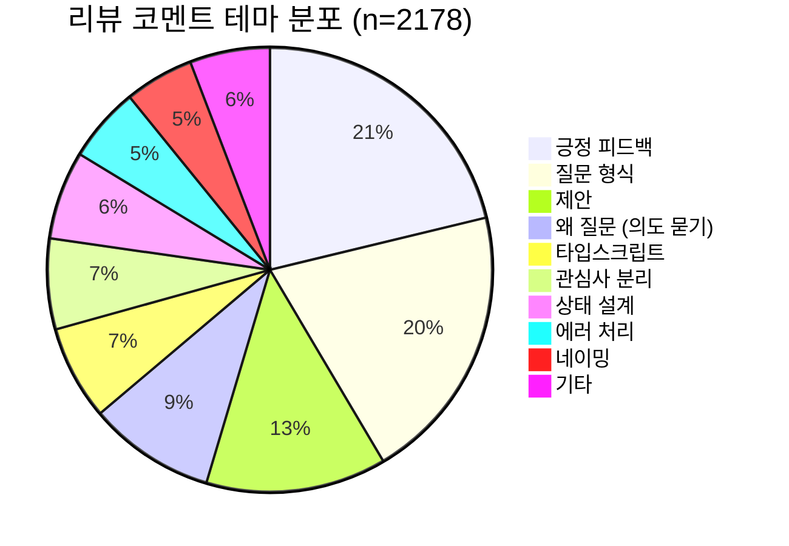
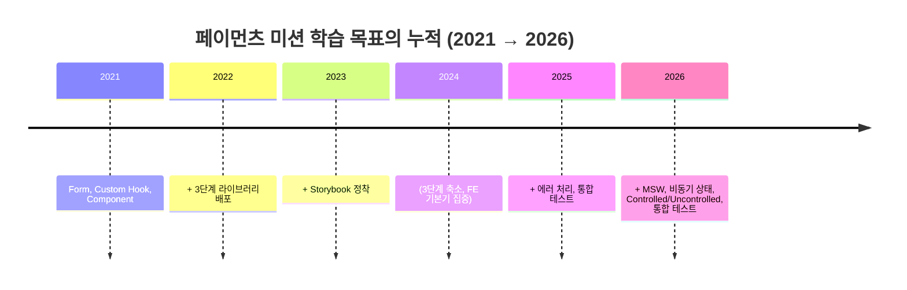

# React 페이먼츠 미션 5년치 PR 555개 데이터 분석

> **대상**: 우테코 웹 프론트엔드 과정 운영진·코치·교육 모델 설계자
>
> **맥락**: `woowacourse/react-payments` 저장소는 2021년 4월 개설 이래 5년 동안 215명의 크루가 555개의 PR을 남긴, FE 과정에서 가장 오래 살아남은 단일 미션 저장소다. 이 안에 누적된 데이터로 "크루들이 어떤 주제로 고민하고 어떤 리뷰를 받았는가"를 시계열로 추적할 수 있다.
>
> **핵심 질문**: ① 5년 동안 학습 주제는 어떻게 진화했는가? ② 미션 자체는 어떻게 재설계됐는가? ③ 코치·리뷰어들의 코칭 패턴에는 어떤 공통점이 있는가? ④ 크루들이 가장 깊게 고민한 영역은 어디인가?

## 맥락

우테코 FE 과정의 페이먼츠 미션은 "재사용 가능한 컴포넌트", "Form 상태 관리", "Custom Hook 분리"라는 React의 핵심 학습 목표를 담는 그릇이다. 2021년 처음 개설된 이래 매년 새로운 기수가 동일한 저장소로 PR을 보내왔고, 매년 코치와 리뷰어들은 그 PR에 직접 코멘트를 단다. 결과적으로 이 저장소 하나에 우테코 FE 교육의 5년치 압축 기록이 쌓였다.

이 로그는 그 압축 기록을 데이터 분석으로 풀어낸 결과다. 정량 분석으로 패턴을 보고, 그 안에서 정성적으로 의미 있는 대화를 골라 인용한다.

## 시도한 것

### 데이터 수집 (2026-05-26 기준)

- **PR 메타데이터**: GitHub REST API `/repos/woowacourse/react-payments/pulls` 엔드포인트로 **555개 PR** 전수 수집 (state=all, 2021-04 ~ 2026-05)
- **PR 본문**: 555개 PR의 본문 텍스트 전체 (`body` 필드) — 평균 2,668자, 최대 15,394자
- **리뷰 코멘트**: 코멘트가 가장 많은 상위 30개 PR에 대해 `/issues/{n}/comments`(상위 토론)와 `/pulls/{n}/comments`(라인 코멘트) 모두 수집 → 총 **2,360건의 코멘트** (인간 2,178건, 봇 182건)

### 분석 도구

- jq로 JSON 가공, Python으로 키워드 매칭 및 통계 집계
- 주제 분류기(taxonomy): 24개 카테고리(form-handling, state-management, controlled-uncontrolled, MSW, error-handling, ...)를 정규식 키워드 사전으로 매칭
- 리뷰 코멘트 테마 분류기: 20개 카테고리(긍정 피드백, 질문, "왜" 질문, 제안, 관심사 분리, 네이밍, ...)

## 관찰

### 1) 5년치 제출 규모

저장소 전체 통계:

| 항목 | 수치 |
| --- | --- |
| 누적 PR 수 | 555개 |
| 누적 작성자(크루) 수 | 215명 |
| 누적 코멘트(상위 30 PR 기준) | 2,360건 |
| 누적 본문 글자 수 | 약 148만 자 |
| 저장소 fork 수 | 231 |

저장소 별 수는 38개에 불과하지만 fork가 231개라는 점은 이 저장소가 **북마크용이 아니라 실제 학습용으로 분기**되어 사용되었다는 신호다.

### 2) 연도별 PR 분포와 미션 단계 매트릭스

```text
연도별 PR 제출 수
2021  ████████████████                              47
2022  ██████████████████████████████████████        117
2023  ██████████████████████████████████████████████████  145
2024  ██████████████████████████                    77
2025  ██████████████████████████████                89
2026  ████████████████████████████                  80
```

| 연도 | 1단계 | 2단계 | 3단계 | 미분류 | 총합 |
| --- | --- | --- | --- | --- | --- |
| 2021 | 25 | 22 | **0** | 0 | 47 |
| 2022 | 38 | 40 | **39** | 0 | 117 |
| 2023 | 49 | 49 | 47 | 0 | 145 |
| 2024 | 38 | 38 | **1** | 0 | 77 |
| 2025 | 45 | 40 | **0** | 4 | 89 |
| 2026 | 28 | 25 | **26** | 1 | 80 |

3단계의 **흥망 패턴**이 뚜렷하다: **2022년 도입 → 2023년 정점 → 2024–2025년 폐지 → 2026년 부활**. 부활한 2026년의 3단계는 단순한 이전 미션의 복구가 아니다. PR 제목이 모두 `[페이먼츠 3단계 - MSW & Async & Testing]`으로 시작한다. 즉 **미션이 비동기 상태 관리·MSW 모킹·통합 테스트라는 완전히 새로운 학습 목표로 재설계**됐다.

### 3) 학습 주제의 진화 — 24개 카테고리 × 6년 매트릭스

555개 PR 본문에서 24개 카테고리를 매칭한 결과의 시계열 분포(% = 해당 연도 PR 중 그 주제를 다룬 비율):

| 주제 | 2021 | 2022 | 2023 | 2024 | 2025 | 2026 | 변화 |
| --- | --- | --- | --- | --- | --- | --- | --- |
| form-handling | 81% | 70% | 80% | 89% | 99% | **100%** | 영구 핵심 |
| storybook | 55% | 62% | 81% | 92% | 98% | **98%** | 점진 강화 |
| state-management | 51% | 68% | 64% | 76% | 98% | **100%** | 영구 핵심 |
| component-design | 47% | 50% | 45% | 60% | 98% | **100%** | 점진 강화 |
| custom-hooks | 32% | 36% | 45% | 61% | 76% | **99%** | 점진 강화 |
| reusability | 45% | 44% | 42% | 51% | 98% | **100%** | 점진 강화 |
| validation | 36% | 39% | 30% | 42% | 98% | **100%** | 25→26 폭증 |
| testing | 38% | 38% | 38% | 28% | **94%** | 100% | 24→25 폭증 |
| controlled-uncontrolled | 30% | 25% | 15% | 14% | 61% | **96%** | 25→26 폭증 |
| typescript | 19% | 44% | 39% | 41% | 38% | **57%** | 점진 강화 |
| error-handling | 4% | 11% | 8% | 11% | **98%** | 100% | 24→25 폭증 |
| async | 17% | 10% | 8% | 0% | 1% | **99%** | **25→26 100배 점프** |
| msw | 4% | 6% | 6% | 7% | 6% | **99%** | **25→26 신설** |
| separation-of-concerns | 4% | 13% | 10% | 16% | 35% | **57%** | 점진 강화 |
| focus-ux | 17% | 21% | 27% | 32% | 26% | **40%** | 점진 강화 |
| react-router | 6% | 16% | 31% | 4% | 9% | **30%** | 단계 의존 |
| performance | 11% | 21% | 21% | 22% | 22% | **24%** | 안정적 관심 |
| accessibility | 0% | 1% | 4% | 5% | 0% | **0%** | 감소 |
| styling | 40% | 37% | 26% | 37% | 22% | **20%** | **감소** |
| props-drilling | 4% | 5% | 12% | 12% | 14% | **8%** | 안정 |
| compound-component | 0% | 1% | 0% | 4% | 2% | **6%** | 미미 |

가장 인상적인 변화 세 가지:

1. **2025년 폭증 카테고리** (24→25 점프): testing(28%→94%), error-handling(11%→98%). 미션이 "정상 케이스만 동작" 수준에서 "에러 처리·테스트까지 책임진다"로 기준이 올라간 신호다.
2. **2026년 신설 카테고리** (25→26 점프): async(1%→99%), msw(6%→99%), controlled-uncontrolled(61%→96%). 페이먼츠 미션이 비동기·서버 통신·통합 테스트를 통합한 형태로 완전히 재설계됐다.
3. **감소한 단 하나의 주제**: styling(40%→20%). 5년 동안 유일하게 비중이 절반으로 줄어든 주제다. CSS 라이브러리 선택의 문제가 미션의 본질이 아니라는 판단이 누적된 결과로 해석된다.

### 4) PR 본문 평균 길이의 폭증

| 연도 | 평균 본문 길이 | 최대 | n |
| --- | --- | --- | --- |
| 2021 | 2,317자 | 7,087자 | 47 |
| 2022 | 1,777자 | 9,632자 | 117 |
| 2023 | 1,732자 | 7,552자 | 145 |
| 2024 | 2,075자 | 7,224자 | 77 |
| 2025 | **3,154자** | 7,840자 | 89 |
| 2026 | **5,911자** | **15,394자** | 80 |

5년 사이 PR 본문의 평균 길이가 **2.5배** 증가했다. 2026년 최대값 15,394자는 한국어로 약 4페이지 분량이다. 단순한 코드 변경 안내가 아니라 **자기 분석·테크 스펙·논의 주제·셀프 리뷰**가 본문에 함께 담기는 문화가 정착했다는 신호다.

### 5) 기술 어휘 분포 — 555개 본문에서의 키워드 빈도

| 키워드 | 등장 횟수 |
| --- | --- |
| Storybook | 653회 |
| useContext / Context API | 306회 |
| React Testing Library | 256회 |
| useState | 198회 |
| MSW | 192회 |
| useEffect | 184회 |
| styled-components | 102회 |
| react-router | 90회 |
| useRef | 84회 |
| TypeScript | 78회 |
| useMemo | 58회 |
| useReducer | 47회 |
| useCallback | 43회 |
| compound component | 14회 |
| **Redux / Zustand / Recoil 합계** | **9회** |

핵심: **외부 상태관리 라이브러리 합계가 9회**에 그친다. 페이먼츠 미션은 5년 내내 **React 기본기(Context API + useState + useEffect)만으로 풀도록 설계**됐다는 것을 데이터가 확정한다.

### 6) 크루의 자기 성찰 어휘 — 555개 본문 누적 빈도

| 어휘 | 누적 등장 |
| --- | --- |
| 고민 | 1,177회 |
| 재사용 | 1,107회 |
| 학습 | 466회 |
| 책임 | 330회 |
| 추상화 | 175회 |
| 어려웠 | 174회 |
| 리팩토링 | 128회 |
| 관심사 | 114회 |
| 확장성 | 106회 |
| 응집도 | 35회 |
| 트레이드오프 | 19회 |
| 결합도 | 11회 |

5년치 PR에서 "고민"이 1,177회 등장한다. PR 1건당 평균 2회씩 "고민"이 명시된 셈이다. 우테코 학습 문화의 핵심 어휘가 무엇인지 데이터가 직접 보여준다.

### 7) 작성자(크루) 반복 패턴

| 제출 횟수 | 작성자 수 |
| --- | --- |
| 1회만 제출 | 6명 |
| 2회 제출 | 90명 |
| 3회 이상 제출 | **119명** |
| **재제출 비율** | **97%** |

215명 중 209명(97%)이 같은 미션에 2회 이상 PR을 보냈다. 한 번 통과로 끝나는 게 아니라 **여러 단계를 거치며 같은 저장소로 다시 돌아오는 반복 학습 구조**가 자리잡고 있다.

### 8) 리뷰 코멘트 분석 — 상위 30개 PR, 2,178건의 인간 코멘트

가장 활발한 리뷰어 Top 15:

| 리뷰어 | 코멘트 수 | 추정 역할 |
| --- | --- | --- |
| 365kim | 269 | 코치 (반복 등장) |
| yujo11 | 206 | 코치 (반복 등장) |
| InSeong-So | 118 | 외부 리뷰어 |
| JunilHwang | 110 | 외부 리뷰어 |
| yeongipark | 88 | 크루(상호 리뷰) |
| woowa-euijinkk | 85 | 코치 |
| ohgus | 75 | 크루(상호 리뷰) |
| brgndyy | 74 | 크루(상호 리뷰) |
| Vallista | 73 | 외부 리뷰어 |
| pocojang | 73 | 외부 리뷰어 |
| JUDONGHYEOK | 70 | 크루(상호 리뷰) |
| tkdrb12 | 68 | 크루(상호 리뷰) |
| llqqssttyy | 66 | 크루(상호 리뷰) |
| wonsss | 63 | 크루(상호 리뷰) |
| devhyun637 | 46 | 크루(상호 리뷰) |

**크루-크루 상호 리뷰 문화**가 명확하다. yeongipark, ohgus, brgndyy처럼 본인이 미션을 제출한 동기 크루들이 다른 크루의 PR에 적극적으로 리뷰를 단다.

리뷰 코멘트 2,178건의 테마 분류:



- **긍정 피드백 37%** + **질문 형식 35%** + **제안 23%** = 95%
- "왜?" 형태의 의도 묻기 16% — 정답이 아닌 사고를 묻는 질문

질문(35%) + "왜" 질문(16%)을 합치면 **절반에 가까운 51%가 답이 아니라 질문**이다. 이는 우테코의 소크라테스식 리뷰 문화의 정량적 증거다.

### 9) 의미 있는 리뷰 사례 5선

데이터에서 가장 깊은 토론이 오간 코멘트를 골라 인용한다. 모두 원문 인용이며 PR 번호를 함께 남긴다.

#### 사례 1 — 포코(pocojang)의 깊이 코칭 ([PR #213](https://github.com/woowacourse/react-payments/pull/213))

> 빡시게 공부 잘하셨고요! 다음부터는 이해하려고 노력해보셨으면 좋겠어요. 지금은 백과사전의 내용을 외운 느낌이 살짝 드는데 `웹 브라우저 주소창에 URL을 입력하면 일어나는 일` 관점에서 이해해보실 필요가 있어요.
>
> 결론적으로 리액트 라우터를 사용해서 `Path`를 지정했는데 왜 주소창에서 입력하면 진입이 안되고 화면단에서 클릭해서 넘어가면 이동이 될까? 요 포인트를 100% 이해하시고 넘어가시면 되는 부분입니다.

지식이 아니라 **이해의 깊이**를 묻는 코칭. "잘했다"는 칭찬과 "더 깊이 가라"는 도전 과제가 한 메시지 안에 공존한다.

#### 사례 2 — 365kim의 공식 문서 인용 코칭 ([PR #390](https://github.com/woowacourse/react-payments/pull/390))

> effect 관련 좋은 자료가 생각나 같이 첨부해보아요. 언제 effect를 사용할지, 언제 event handling만으로 충분할지 정리해보기 좋은 글이에요 :)
>
> ⭐️추천⭐️: https://react.dev/learn/you-might-not-need-an-effect

리뷰어가 답을 알려주지 않는다. 대신 **공식 문서 한 줄을 추천**한다. 학습자가 직접 읽고 자기 코드와 비교하도록 한다.

#### 사례 3 — InSeong-So의 일관성 진단 ([PR #258](https://github.com/woowacourse/react-payments/pull/258))

> 이건 제3자가 알지 못하는 의도이므로 모든 방어코드를 작성하거나, 느슨하지만 일관된 기능을 프로젝트 코드 전반에 설치해둬야 합니다. `로컬 스토리지를 "왜" 사용했나요?`라는 질문은 아닙니다. 앱의 컨텍스트가 앱에 일관되지 않게 위치해있고, 그와 별개로 로컬 스토리지가 컨텍스트와 동기화되지 않았기 때문입니다.

"왜 X를 썼는가"가 아니라 "왜 X와 Y가 일관되지 않은가"를 묻는다. **개별 결정이 아니라 결정들 사이의 일관성**을 본다.

#### 사례 4 — yujo11의 "주석 = 도메인 설명" 가이드 ([PR #345](https://github.com/woowacourse/react-payments/pull/345))

> `isVisa`나 `isMaster`의 경우 ... 이 코드를 통해 어떤 숫자에 대해서 `true` 또는 `false`를 반환하는지는 알 수 있지만 "왜" 해당 숫자일 때 visa나 master로 판별하는지는 알 수 없는데 이 부분을 말씀드린거였습니다.
>
> 코드를 통해 조건은 알 수 있겠지만 "왜" N세 이하는 사용할 수 없는지는 코드를 보고는 알 수 없는 도메인(정책)에 의해 정해지는 부분이고 코드로는 설명이 불가능한 부분입니다.

**"코드로 표현할 수 없는 도메인 지식만 주석에 남긴다"** 는 원칙을 구체 사례로 코칭. 이건 책에서 베껴오기 어려운 깊이의 가이드다.

#### 사례 5 — 호이의 깨달음 댓글 ([PR #448](https://github.com/woowacourse/react-payments/pull/448))

> 이 말씀을 듣고 나니, 제가 너무 재사용성에만 집착하고 있었던 것 같습니다. 이번 payment 미션을 처음 봤을 때도 "이건 무조건 재사용해야지!"라는 관점으로 접근했던 것 같습니다. 하지만 동키콩 말씀처럼, "이 컴포넌트가 담당하는 책임은 무엇인가?" 라는 질문을 먼저 생각해보면, 꼭 재사용을 위한 분리만이 정답은 아니구나 ...

**리뷰어의 한 질문이 학습자의 멘탈 모델을 바꾸는 순간**이 PR 코멘트에 그대로 기록돼 있다. "재사용 = 좋은 것"이라는 단순한 휴리스틱에서 "책임이 무엇인가가 먼저"로의 이동.

## 해석

### 해석 1 — 페이먼츠 미션은 "Form + 컴포넌트 + 상태 관리"라는 **5년 불변의 골격** 위에 매년 학습 목표가 새롭게 누적되는 구조다

form-handling, storybook, state-management, component-design은 모든 연도에서 50% 이상의 PR이 다루는 영구 핵심 주제다. 그 위에 매년 새로운 요구가 더해진다.



미션은 단순 반복이 아니다. **누적 학습 모델**이다.

### 해석 2 — 2026년의 미션 재설계는 "기능 동작"에서 "서버 경계 설계"로 학습 단위가 한 단계 추상화됐다는 신호다

2026년 PR 본문에 나타난 표현들이 그것을 보여준다:

- "MSW로 네트워크 경계를 모킹하고, 프론트엔드가 보는 서버의 모습을 설계한다"
- "비동기 상태를 `idle | loading | success | error` 네 가지로 명시적으로 관리"
- "실제 서버에 보낼 요청·받을 응답 형식을 설계하여 서버-클라이언트 계약을 경험"

핵심 단어는 **"설계"** 와 **"계약"** 이다. 컴포넌트가 잘 동작하는지가 아니라 **컴포넌트가 서버라는 외부 시스템과 어떻게 계약을 맺을지를 설계**하는 게 학습 목표가 됐다.

### 해석 3 — 우테코 FE 리뷰 문화의 정량적 특징: "질문 51% + 긍정 37% + 제안 23%"

부정 지적이 아니라 **질문과 발견**이 리뷰의 주된 형태다.

- "왜 그렇게 했어요?" — 의도 묻기 16%
- "이렇게 해보면 어떨까요?" — 대안 제시 23%
- "이건 좋네요" — 잘한 부분 명시 37%
- "정답을 알려주기보다 공식 문서 링크 한 줄을 추천한다" — 365kim 패턴

이는 학습자를 정답으로 끌고 가는 게 아니라 **학습자가 스스로 답을 찾도록 자극하는 코칭 구조**다. 데이터로 본 우테코 리뷰의 본질이다.

### 해석 4 — PR 본문 길이의 폭증은 "코드 설명"에서 "사고 과정 공유"로 PR의 의미가 바뀌었다는 증거다

| 연도 | 평균 본문 길이 | 변화 의미 |
| --- | --- | --- |
| 2021–2023 | ~2,000자 | 코드 변경 설명 위주 |
| 2024 | 2,075자 | 점진 증가 |
| 2025 | 3,154자 | **셀프 리뷰·고민 명시 정착** |
| 2026 | **5,911자** | **테크 스펙·논의 주제·자기 분석 동반** |

2026년 본문에는 단순한 "구현 완료" 문구 대신 다음과 같은 구조가 일관되게 등장한다:

1. 학습 목표 (1단계/2단계/3단계 각각의 학습 의도)
2. 셀프 리뷰 체크리스트
3. **이번 단계에서 가장 많이 고민했던 문제**
4. **리뷰를 통해 논의하고 싶은 부분**
5. 리뷰어 체크 포인트

PR은 이제 코드 제출 도구가 아니라 **학습자의 사고 과정과 리뷰어의 코칭이 만나는 대화 공간**이다.

### 해석 5 — 페이먼츠 미션은 외부 라이브러리를 의도적으로 배제한다

Redux/Zustand/Recoil/React Query의 합계 언급이 555개 본문에서 단 16회. Context API 언급은 306회. **"라이브러리로 추상화하기 전에 React 기본기로 끝까지 풀어본다"** 가 5년 내내 흔들리지 않은 설계 원칙이다.

이는 페이먼츠 미션 이후 다른 미션(react-shopping-cart 등)에서 외부 라이브러리를 본격적으로 도입하는 구조와 연결돼야 의미가 살아난다.

### 해석 6 — 크루 간 상호 리뷰가 코치 리뷰만큼 활발하다

상위 리뷰어 15명 중 절반(yeongipark, ohgus, brgndyy, JUDONGHYEOK 등)이 본인도 페이먼츠 미션을 제출한 크루다. 즉 **"나도 막 미션을 끝낸 사람"이 다른 크루의 미션을 리뷰**한다. 이는 "선배 코치 → 후배 크루"의 일방향 흐름이 아니라 **동료 학습 네트워크**가 PR 단위로 작동한다는 신호다.

## 다음 실험

### 단기

1. **다른 미션 저장소도 동일 방식으로 분석**하여 페이먼츠와 비교
   - `react-shopping-cart` (외부 라이브러리 도입 미션)
   - `react-step-payments` (이전 세대 페이먼츠 — fork 관계 추적)
   - 두 저장소를 5년 매트릭스로 비교하면 미션 간 학습 단계의 차이가 정량화된다
2. **2026년 80개 PR을 단독 분석**하여 "비동기 상태 관리" 도입 첫 해에 크루들이 어떤 패턴으로 막혔는지 정성 분석
3. **상위 30 → 100 PR로 리뷰 코멘트 수집 확장**하여 코치 리뷰어 vs 크루 리뷰어의 코칭 스타일 차이를 정량화

### 중기

4. **2021–2026 코치 핵심 인용구 50개를 추출**해 우테코 리뷰 코칭의 "패턴 카탈로그" 초안 작성
5. **PR 본문 길이가 5,000자 이상인 64개 PR을 정성 코딩**하여 "장문 PR이 다루는 주제"의 분포 파악
6. 본 분석 결과를 `/education/design-patterns`와 `/education/curriculum`로 승격할 수 있는 후보로 검토

### 장기

7. 다른 우테코 미션 저장소(자바 MVC, JDBC 등)를 동일 방식으로 분석하여 **백엔드/프론트엔드 리뷰 문화의 비교**가 가능한 데이터셋 구축
8. 매년 자동 갱신되는 **연간 미션 리포트 파이프라인** 구축 (`/research-cycle` 패턴 확장)

## 원본 자료

### 분석 대상 저장소

- **woowacourse/react-payments** — https://github.com/woowacourse/react-payments
  - 555개 PR 전수, 2021-04 ~ 2026-05
  - PR 본문 평균 2,668자, 최대 15,394자
  - 215명의 크루 작성자
  - 상위 30 PR의 코멘트 2,360건

### 인용된 리뷰 사례 PR

- PR #213 — 포코 코칭: https://github.com/woowacourse/react-payments/pull/213
- PR #390 — 365kim 코칭: https://github.com/woowacourse/react-payments/pull/390
- PR #258 — InSeong-So 일관성 진단: https://github.com/woowacourse/react-payments/pull/258
- PR #345 — yujo11 주석 가이드: https://github.com/woowacourse/react-payments/pull/345
- PR #448 — 호이 깨달음 댓글: https://github.com/woowacourse/react-payments/pull/448
- PR #468 — 메타(조유담)의 19코멘트 토론 — 가장 활발한 PR: https://github.com/woowacourse/react-payments/pull/468
- PR #576 — 2026년 5월 최신, MSW & Async & Testing 단계: https://github.com/woowacourse/react-payments/pull/576

### 분석 스크립트와 원본 데이터

분석에 사용된 jq/Python 스크립트와 수집한 JSON은 작업 디렉터리 `.inbox/react-payments-analysis/` 에 보존되어 있다(저장소에는 커밋되지 않음, `.gitignore` 처리). 재현이 필요할 경우 GitHub REST API 인증 후 동일 절차로 재수집할 수 있다.

```text
.inbox/react-payments-analysis/
├── all_pulls.json          # 555 PR 메타데이터
├── all_bodies.json         # 555 PR 본문
├── pr_topics.json          # 24 카테고리 매칭 결과
├── top_comments.json       # 상위 200 PR (코멘트 수 정렬)
├── review_comments.jsonl   # 상위 30 PR의 2,360 코멘트
├── human_comments.json     # 인간 코멘트 2,178건
├── reviewer_stats.json     # 리뷰어별 코멘트 수
└── review_theme_examples.json  # 테마별 예시
```
